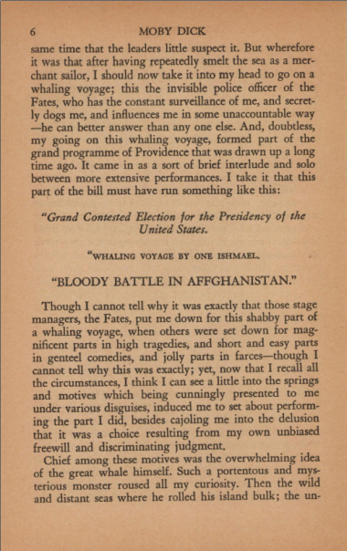
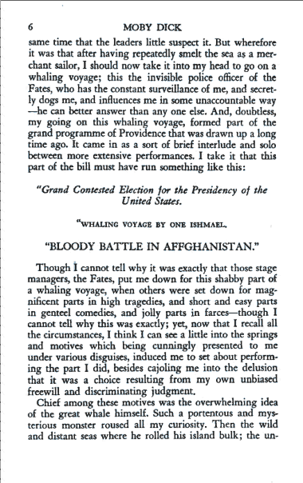

# bookscanOCR
A command-line program to deskew and OCR text in PDF documents. Ideal for scanned books where each image corresponds to a page. 

 

Compare to [OCRmyPDF](https://github.com/ocrmypdf/OCRmyPDF/) but simplified for the specific use case of books.

## Features
- Generates a searchable PDF from one containing images only
- Optimizes file size by converting images to black and white and compressing them losslessly
- Deskews text before performing OCR
- Output files are PDF-1.7 compliant
- Distributes work according to the number of CPU cores on your machine
- Uses [Tesseract](https://github.com/tesseract-ocr/tesseract), the open-source OCR engine
- Preserves the resolution of the original images
- Runs offline

## Installation
First, install [Python](https://www.python.org/downloads/) or update your installation to 3.8+

You can then use pip to install the following dependencies:
`pip install numpy`
`pip install scikit-learn`
`pip install opencv-contrib-python`
`pip install pillow`
`pip install PyMuPDF`
`pip install pytesseract`

Place the .py scripts from this repository into your project directory. If you're on Windows, grab jbig2.exe from [here](https://sourceforge.net/projects/jbig2enc/files/latest/download) and place it in the same directory.

## Usage
`>python bookscanOCR.py -h`
```
usage: bookscanOCR.py [-h] [--output_file OUTPUT_FILE] [--lang LANG]
                      [--front-cover] [--back-cover]
                      [--angle-range ANGLE_RANGE] [--skip-ocr] [--clustering]
                      [--title TITLE] [--author AUTHOR] [--subject SUBJECT]
                      [--keywords KEYWORDS]
                      input_file

This script will attempt to deskew, compress, and OCR your book scans

positional arguments:
  input_file            Input PDF file for OCR

optional arguments:
  -h, --help            show this help message and exit
  --output_file OUTPUT_FILE
                        Output file name - if not provided, it will be set to input_file + "_OCR"
  --page_intervals PAGE_INTERVALS
                        Comma-separated string of page intervals  -- e.g. "3,5-7,21" -- use 1-indexing 
  --lang LANG           Language selection for OCR. Default is 'eng'
  --front-cover         Pass the first page of the input PDF to the output unchanged. Applies after page_intervals
  --back-cover          Pass the final page of the input PDF to the output unchanged. Default is False
  --angle-range ANGLE_RANGE
                        Deskewing: search for optimal angle between +/- angle_range degrees. Default is 2
  --skip-ocr            Perform deskewing and thresholding / compression only
  --dpi-cap DPI_CAP     Output PDF resolution matches input unless greater than cap. Default is None
  --clustering          Use GMM clustering to detect empty pages
  --title TITLE         Set tags in metadata. Place input string in quotes.
  --author AUTHOR       ''
  --subject SUBJECT     ''
  --keywords KEYWORDS   '' comma-separated
```
## Notes

There is a quirk about Tesseract OCR that [causes the text bounds to exclude the last character in a word](https://github.com/tesseract-ocr/tesseract/issues/2879). The issue is apparent in files produced by any program that uses Tesseract. There is a ["patch"](https://github.com/tesseract-ocr/tesseract/issues/2879#issuecomment-583896719) that improves the issue for those who want to build Tesseract themselves.

## Acknowledgements
Thank you to the following github users whose code was modified for this project:

deskewing routine from [endolith](https://gist.github.com/endolith/334196bac1cac45a4893#)'s gist

CCITT G4 encoding routine from [josch](https://github.com/josch/img2pdf)'s  img2pdf tool


### possible improvements:
- finesse handling of pages containing images without text
- apply deskewing to pre-existing hOCR layer
- make scaling more robust by chopping input file according to available memory
